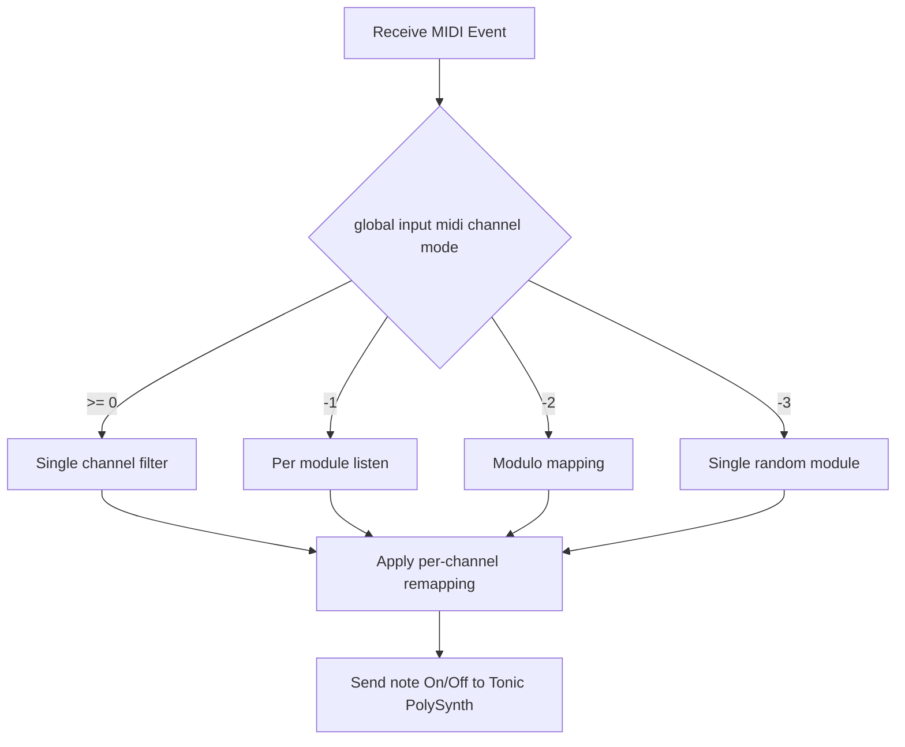

# Configuring Audio and MIDI – MIDI Channel to Sampler Module Mapping

This section explains how incoming MIDI channels (0–15) are routed to sampler modules in the Spitonic MIDI Instrument. You’ll learn how to control which MIDI channels are listened to, how they map to modules, and how to customize this behavior at runtime.

## global_inputmidichannel Modes

The **global_inputmidichannel** setting dictates which MIDI channels the application listens to and how they map to sampler modules .

| Value | Behavior | Description |
| --- | --- | --- |
| 0–15 | Single-channel filter | Only events on that channel are processed. They all route to the **selected** sampler module. |
| –1 | Module-per-channel listen | Listens to all channels for which a sampler module exists (module index = channel index). |
| –2 | Spread-across modules | Maps every incoming channel to a module via `channel % numberOfModules`. |
| –3 | Single-random module | All channels map to one **randomly selected** module; you can change this module at runtime with the mouse. |
| < –3 or > 15 | Clamped to [–3, 15] | Values below –3 become –3; above 15 become 15. |


## Channel-to-Module Remapping

> **Note:** The left mouse button selects a different sampler module when in **–3** mode .

Beyond the global mode, you can **remap** individual MIDI channels to arbitrary modules using the **global_midichanneltosamplermoduleremapping** array. This allows, for example, channel 0 → module 3, channel 1 → module 0, etc.

| Variable | Default | Purpose |
| --- | --- | --- |
| `global_midichanneltosamplermoduleremapping_enabled` | `0` (disabled) | Toggles per-channel remapping. |
| `global_midichanneltosamplermoduleremapping[]` | identity (i.e. `[0,1,2…]`) | Holds the target module index for each MIDI channel. |


```cpp
// Initialize identity mapping: channel i → module i
for (int i = 0; i < SPITMIPS_MAXNUMBEROFSAMPLERMODULES; i++) {
    global_midichanneltosamplermoduleremapping[i] = i;
}
```

### Shuffling Remapping (S Key)

Press **S** to toggle between:

- **No remapping** (identity): channels map to same-index modules.
- **Shuffled remapping**: channels map in random order to loaded modules, using Fisher–Yates shuffle.

```cpp
// S key handler
if (global_midichanneltosamplermoduleremapping_enabled > 0) {
    // Disable remapping
    global_midichanneltosamplermoduleremapping_enabled = 0;
    // Restore identity
    for (int i = 0; i < SPITMIPS_MAXNUMBEROFSAMPLERMODULES; i++)
        global_midichanneltosamplermoduleremapping[i] = i;
} else {
    // Enable and shuffle
    global_midichanneltosamplermoduleremapping_enabled = 1;
    // Fisher–Yates over loaded modules
    for (int i = global_numberofsamplermodules - 1; i >= 1; i--) {
        int j = RandomInt(0, i);
        swap(global_midichanneltosamplermoduleremapping[j],
             global_midichanneltosamplermoduleremapping[i]);
    }
}
```

## Runtime MIDI Event Routing

Incoming MIDI is polled in `receive_poll`. Events pass through the following routing logic:



1. **Read & parse** each MIDI event (status, channel, data1, data2).
2. **Mode dispatch** based on `global_inputmidichannel`.
3. **Channel remap** (if enabled) via

```cpp
   chan = global_midichanneltosamplermoduleremapping[chan];
```

1. **Send** `noteOn`/`noteOff` calls to the corresponding `poly[chan]` instance.

### Single-Random Module (–3)

In **–3** mode, all channels route to the **selected** module index (`global_samplermodulesindex_selected`):

```cpp
} else if (global_inputmidichannel == -3) {
    // Map every channel to the one selected module
    chan = global_samplermodulesindex_selected;
    // ...process note On/Off...
}
```

Use the left mouse button to cycle `global_samplermodulesindex_selected` at runtime.

## Practical Tips 👍

- **Clamp values**: If you pass an out-of-range `global_inputmidichannel`, it auto-clamps to [–3, 15] .
- **Debugging**: Enable `global_mididebugmode` (via **D** key) to print raw MIDI messages.
- **Consistent remapping**: For repeatable mappings, disable the shuffle and manually edit the mapping array in your launch script.
- **Polyphony control**: Monitor `global_numberofnotes_on` to avoid hanging notes; the code skips extraneous “all notes off” bursts.

---

With these controls, you can flexibly assign MIDI channels to any of your loaded sampler modules, whether strictly one-to-one, spread across modules, or dynamically randomized for live performance.