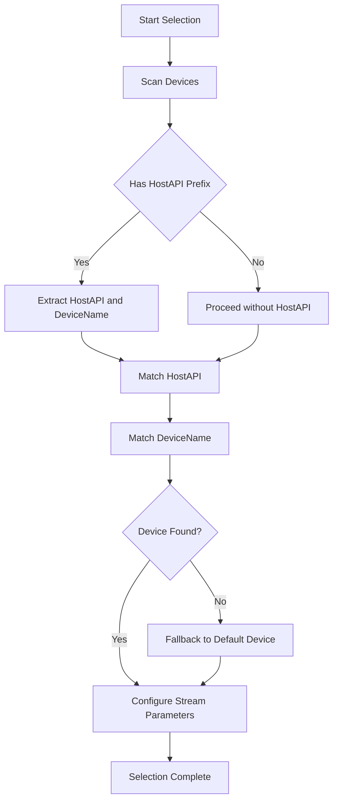

# Configuring Audio and MIDI – Selecting Audio Output Device

This section explains how to choose and configure the audio output device in the Win32 C++ MIDI sampler. The application uses a custom `SPIAudioDevice` helper to translate user-provided host API and device names into PortAudio stream parameters. Proper configuration ensures accurate routing, low latency, and support for ASIO channel selection.

## SPIAudioDevice Helper Class

The `SPIAudioDevice` class encapsulates device scanning, matching, and PortAudio parameter setup.

**Key Responsibilities:**

- Discover available audio devices and host APIs
- Map a **string name** to a PortAudio device ID
- Configure `PaStreamParameters` including ASIO channel selectors
- Log selection steps and mismatches to `devices.txt`

## 🎛️ Setting the Audio Output Device Name

You can specify the desired output device in two ways:

1. **Command-line argument** (4th parameter)
2. **Runtime key commands** (e.g., V, W, X choose common devices)

**Command-line Syntax:**

| Argument Index | Purpose |
| --- | --- |
| 3 | **Audio output device name** |
| 4 | **ASIO channel selector (left)** |
| 5 | **ASIO channel selector (right)** |


```cpp
// Default to E-MU ASIO if no argument provided
mySPIAudioDevice.global_audiooutputdevicename = "E-MU ASIO";

// Override via CLI
if (nArgs > 3) {
  mySPIAudioDevice.global_audiooutputdevicename = szArgList[3];
}
if (nArgs > 4) {
  mySPIAudioDevice.global_outputAudioChannelSelectors[0] = atoi(szArgList[4]);
}
if (nArgs > 5) {
  mySPIAudioDevice.global_outputAudioChannelSelectors[1] = atoi(szArgList[5]);
}
```

## Host API and Device Name Syntax

Optionally, you can prefix the device name with a host API followed by a colon:

```plaintext
<HostAPI>:<DeviceName>
```

- **HostAPI** examples: `"ASIO"`, `"MME"`, `"WDMKS"`, `"WASAPI"`.
- If omitted, the helper attempts to match any API.

During scanning, the helper splits on `:` and logs the prefix:

```plaintext
hostapi has been specified:
global_audiooutputhostapi=ASIO, global_audiooutputdevicename=E-MU ASIO
```

## Channel Selection for ASIO Devices

For ASIO outputs, you can route specific hardware channels via the `global_outputAudioChannelSelectors` array:

| Selector Index | Description | Default (E-MU PatchMix) |
| --- | --- | --- |
| 0 | Left channel index | 0 |
| 1 | Right channel index | 1 |


These selectors are applied when building the `PaAsioStreamInfo`:

```cpp
global_asioOutputInfo.size            = sizeof(PaAsioStreamInfo);
global_asioOutputInfo.hostApiType     = paASIO;
global_asioOutputInfo.version         = 1;
global_asioOutputInfo.flags           = paAsioUseChannelSelectors;
global_asioOutputInfo.channelSelectors= global_outputAudioChannelSelectors;
```

```card
{
    "title": "ASIO Channel Limit",
    "content": "Ensure your indices stay below the device\u2019s maxInputChannels."
}
```

## Device Scanning and Matching Process

Below is the high-level flow for output device selection:



1. **Scan Devices:** Build `global_outputdevicemap` of all PortAudio devices.
2. **HostAPI Prefix Check:** If a colon is found, extract the host API.
3. **Match Host API:** Use `MatchHostAPI` for a loose string match.
4. **Match Device Name:** Use `MatchDevice` with optional host API filter.
5. **Fallback:** If no match, revert to the default device.

## ⚙️ Configuring PortAudio Stream Parameters

The core selection method sets up `global_outputParameters` for the audio stream:

```cpp
bool SPIAudioDevice::SelectAudioOutputDevice() {
  if (global_outputdevicemap.empty())
    ScanAudioDevices();

  int deviceid = ScanAudioDevices("loosely", spiaudiodeviceOUTPUT);
  if (deviceid == paNoDevice)
    return false;

  global_outputParameters.device       = deviceid;
  global_outputParameters.channelCount = global_numchannels;
  global_outputParameters.sampleFormat = PA_SAMPLE_TYPE;
  global_outputParameters.suggestedLatency =
      Pa_GetDeviceInfo(deviceid)->defaultLowOutputLatency;

  // ASIO specific info
  if (deviceid == Pa_GetDefaultOutputDevice()) {
    global_outputParameters.hostApiSpecificStreamInfo = NULL;
  } else {
    int apiType = Pa_GetHostApiInfo(
                    Pa_GetDeviceInfo(deviceid)->hostApi)
                  ->type;
    if (apiType == paASIO)
      global_outputParameters.hostApiSpecificStreamInfo = &global_asioOutputInfo;
    else
      global_outputParameters.hostApiSpecificStreamInfo = NULL;
  }
  return true;
}
```

## Logging and Troubleshooting

All device enumeration, matching results, and warnings are written to **devices.txt**:

- **Device List:** IDs and names for every detected device.
- **Host API Logs:** Confirmation when a prefix is used.
- **Warnings:** Missing host API or device name.
- **Fallback Notices:** When default device is chosen.

```plaintext
id= 0, name=Speakers (Realtek High Definition Audio)
id= 1, name=ASIO4ALL v2
...
warning: hostapi has NOT been specified:
global_audiooutputhostapi=, global_audiooutputdevicename=CABLE Input (VB-Audio Virtual C
```

```card
{
    "title": "Fallback Device",
    "content": "If your specified device isn\u2019t found, the system default is used."
}
```

---

By following these steps, you ensure the sampler routes audio to the intended device, leverages low-latency ASIO channels, and captures all selection activity for debugging.