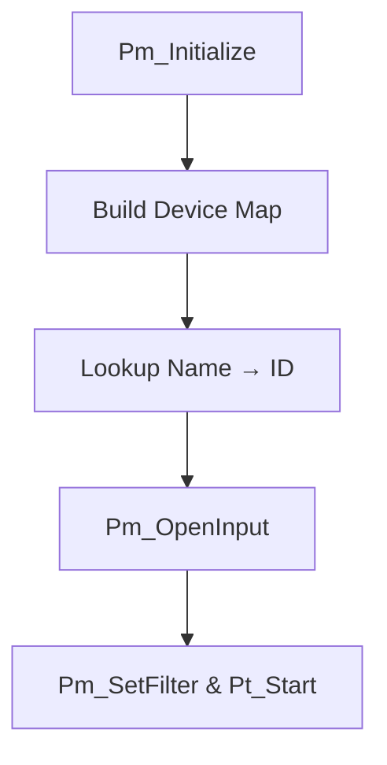

# Configuring Audio and MIDI

## Selecting MIDI Input Device 🎹

This section explains how the application discovers, selects, and switches the MIDI input source using PortMidi. You’ll learn about the initialization process, mapping device names to IDs, opening the input stream, and using keyboard shortcuts to swap devices on the fly.

---

### Overview

The sampler uses PortMidi (via `PmStream*`) to receive MIDI events.

It maintains:

- **global_inputmididevicemap**: maps device names to PortMidi IDs
- **global_inputmididevicename**: the user-visible name of the active MIDI port
- **global_inputmidideviceid**: the numeric PortMidi ID to open

Press **K** or **L** in the GUI to quickly switch between predefined devices. Changes log to the status text control for immediate feedback .

---

### Default Settings

Before any user action, the sampler defaults to listening on a hardware keyboard:

| Setting | Default Value |
| --- | --- |
| **Device Name** | `Q49` |
| **Device ID** | `11` |


These globals are initialized here in the source:

```cpp
int   global_inputmidideviceid   = 11;   // default ID for Q49
string global_inputmididevicename = "Q49";
```

---

### Scanning and Mapping Devices

On startup (or reconnection), the app:

1. Calls `Pm_Initialize()`
2. Iterates `i` from `0` to `Pm_CountDevices() - 1`
3. For each `PmDeviceInfo* info = Pm_GetDeviceInfo(i)`, if `info->input` is true:
4. Inserts `(info->name, i)` into `global_inputmididevicemap`

```cpp
Pm_Initialize();
int numDevices = Pm_CountDevices();
for (int i = 0; i < numDevices; ++i) {
    const PmDeviceInfo* info = Pm_GetDeviceInfo(i);
    if (info->input) {
        global_inputmididevicemap.insert({ info->name, i });
    }
}
```

---

### Mapping Name to ID

After populating the map, the code looks up `global_inputmididevicename`:

```cpp
auto it = global_inputmididevicemap.find(global_inputmididevicename);
if (it != global_inputmididevicemap.end()) {
    global_inputmidideviceid = it->second;
    StatusAddTextA( fmt("%s maps to %d\n", 
        global_inputmididevicename.c_str(), global_inputmidideviceid) );
} else {
    assert(false); // No match: prints all mappings and aborts
}
```

If the lookup fails, the app asserts and logs every available device name → ID pair .

---

### Opening the MIDI Input Stream

With a valid `global_inputmidideviceid`, the sampler opens PortMidi:

```cpp
PmError err = Pm_OpenInput(
    &global_pPmStreamMIDIIN,
    global_inputmidideviceid,
    NULL,       // no callback filter data
    512,        // buffer size
    NULL, NULL  // no timestamp callbacks
);
if (err) {
    StatusAddTextA(Pm_GetErrorText(err));
    Pt_Stop(); // stop porttime
    return;
}
Pm_SetFilter(global_pPmStreamMIDIIN, mySpiMidiUtility.filter);
global_inited = true;
global_active = true;
global_audiomidi_devices = "connected";
```

---

### Starting the PortTime Poll

To continuously poll incoming MIDI events, the sampler uses PortTime:

```cpp
PtError pterr = Pt_Start(1, receive_poll, 0);
if (pterr) {
    StatusAddTextA("Pt_Start failed\n");
    return;
}
```

Here, `receive_poll` reads and dispatches MIDI messages to the synth engine .

---

### Quick Device Switching

In the Win32 message handler (`WM_KEYDOWN`), pressing **K** or **L** changes the MIDI input name on the fly:

```cpp
switch (wParam) {
  case 0x4B:  // 'K' key
    global_inputmididevicename_prev = global_inputmididevicename;
    global_inputmididevicename      = "Q49";
    StatusAddText(fmt("Input → %s\n", 
        global_inputmididevicename.c_str()));
    break;

  case 0x4C:  // 'L' key
    global_inputmididevicename_prev = global_inputmididevicename;
    global_inputmididevicename      = "loopMIDI Port 1";
    StatusAddText(fmt("Input → %s\n", 
        global_inputmididevicename.c_str()));
    break;
}
```

This does **not** automatically re-open the stream; you'll need to disconnect and reconnect (press C) to apply the new device name .

---

### User Feedback in GUI

Every change to `global_inputmididevicename` is immediately logged to the status control:

```cpp
wstring ws(name.begin(), name.end());
swprintf(pWCHAR, L"global_inputmididevicename is %s\n", ws.c_str());
StatusAddText(pWCHAR);
```

This real-time feedback helps you confirm the active MIDI source .

---

### Process Flow



---

### Best Practices

- Ensure your MIDI device is powered and drivers are installed before launching.
- Use **loopMIDI** to create virtual ports for software instruments.
- Match the **exact** device name (case-sensitive) when setting `global_inputmididevicename`.
- Press **C** to disconnect and reconnect devices after changing the name.

---

```card
{
    "title": "Device Not Found",
    "content": "Verify the device name matches exactly. Check the status log for available mappings."
}
```