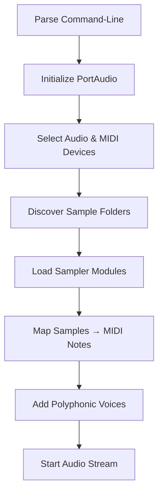

# Getting Started – Core Concepts

Welcome to **Spitonic MIDI Instrument PolySampler**! Before diving in, familiarize yourself with these five core concepts. Understanding them ensures smooth installation, configuration, and operation on Windows desktop systems.

## 1. Sampler Modules

Each **Sampler Module** represents an independent instrument slot:

- Loads a **folder** of WAV samples.
- Binds to a specific **MIDI channel** (0–15).
- Up to **16 modules** can run concurrently.

| Constant | Description |
| --- | --- |
| `SPITMIPS_MAXNUMBEROFSAMPLERMODULES` | Maximum sampler modules (16) |
| `static PolySynth poly[SPITMIPS_MAXNUMBEROFSAMPLERMODULES];` | Array of polyphonic synths |


```cpp
// Define maximum sampler modules
#define SPITMIPS_MAXNUMBEROFSAMPLERMODULES 16

// Instantiate one PolySynth per module
static PolySynth poly[SPITMIPS_MAXNUMBEROFSAMPLERMODULES];
```

## 2. MIDI Note Mapping

Samples in each module map directly to the 128 standard MIDI notes:

- **Notes 0–127** correspond to array indices.
- You can **transpose** modules by octaves at runtime.

| Constant | Description |
| --- | --- |
| `SPITMIPS_NSAMPLES` | Number of MIDI notes (128) |
| `global_numberofoctavetoshift[module]` | Octave transposition array |


```cpp
const int SPITMIPS_NSAMPLES = 128;  // for all MIDI notes 0–127

// Per-module octave shift (–11 to +11)
int global_numberofoctavetoshift[SPITMIPS_MAXNUMBEROFSAMPLERMODULES];
```

## 3. Polyphonic Voices 🎶

Each sampler module supports **polyphony** via Tonic’s **PolySynth**:

- Uses **8 simultaneous voices** by default.
- Voices are allocated with a **Lowest-Note-Stealing** strategy.

| Constant | Description |
| --- | --- |
| `SPITMIPS_NUMBEROFVOICES` | Voices per module (8) |
| `typedef PolySynthWithAllocator<LowestNoteStealingPolyphonicAllocator> PolySynth;` | Voice allocator |


```cpp
// Add voices to each module’s PolySynth
for (int m = 0; m < global_numberofsamplermodules; ++m) {
    poly[m].addVoices(createSynthVoice, SPITMIPS_NUMBEROFVOICES);
}
```

## 4. Audio & MIDI Devices 🎛️

Before playback, select your audio and MIDI interfaces:

1. **PortAudio** initialization

```cpp
   PaError err = Pa_Initialize();
   if (err != paNoError) return 1;
```

1. **Device selection** functions

```cpp
   SelectAudioInputDevice();
   SelectAudioOutputDevice();
```

1. **Global settings**

```cpp
   string global_audioinputdevicename;
   string global_audiooutputdevicename;
   int global_inputmidichannel;
```

### Quick Tips

- On startup, the app writes detected devices to `devices.txt`.
- Use the built-in UI keys (L, V, W, X) to switch between common audio/MIDI ports at runtime.

## 5. Command-Line Configuration 💻

Most settings come from **command-line arguments** when launching the executable. Arguments override defaults in this order:

| Arg # | Purpose | Example |
| --- | --- | --- |
| 1 | Samples folder or list file | `"C:\Samples\MyDrumKit"` |
| 2 | MIDI input device name | `"My MIDI Keyboard"` |
| 3 | MIDI channel (0–15) | `0` |
| 4 | Audio output device name | `"ASIO4ALL v2"` |
| 5 | ASIO left channel selector | `0` |
| 6 | ASIO right channel selector | `1` |
| 7 | Window X position | `100` |
| 8 | Window Y position | `100` |
| 9 | Window width | `800` |
| 10 | Window height | `600` |


```bash
# Launch example
Spitonic.exe "C:\Samples\Orchestral" "LoopMIDI Port 1" 1 "E-MU ASIO" 0 1 50 50 1024 768
```

```cpp
// Inside WinMain: parse arguments
if (nArgs > 1) {
  global_samplesfolder    = szArgList[1];
  global_inputmididevicename = szArgList[1];
}
if (nArgs > 2)
  global_inputmidichannel  = atoi(szArgList[2]);
if (nArgs > 3)
  mySPIAudioDevice.global_audiooutputdevicename = szArgList[3];
if (nArgs > 4)
  mySPIAudioDevice.global_outputAudioChannelSelectors[0] = atoi(szArgList[4]);
if (nArgs > 5)
  mySPIAudioDevice.global_outputAudioChannelSelectors[1] = atoi(szArgList[5]);
if (nArgs > 6) global_x       = atoi(szArgList[6]);
if (nArgs > 7) global_y       = atoi(szArgList[7]);
if (nArgs > 8) global_xwidth  = atoi(szArgList[8]);
if (nArgs > 9) global_yheight = atoi(szArgList[9]);
```

---

## High-Level Startup Flow



This diagram outlines the application’s initialization sequence, emphasizing how core concepts fit together.