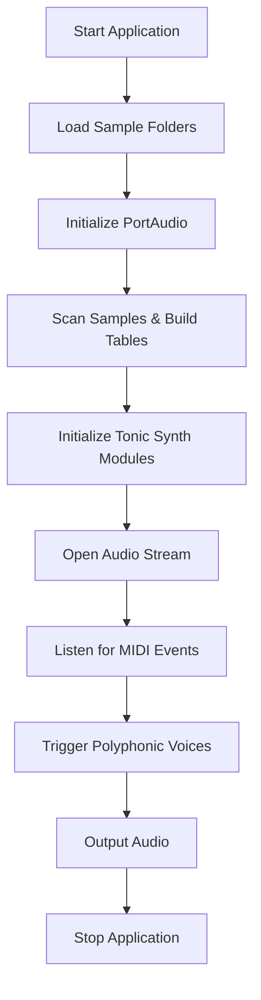

# Getting Started – What This Application Does

This Windows desktop application is part of the **AUDIO_SPI** collection. It provides a polyphonic MIDI sampler instrument that:

- Loads one or more folders of audio samples (typically `.wav`).
- Maps samples across the full 128-note MIDI range.
- Plays them in real time in response to MIDI input.
- Outputs audio through PortAudio devices.

---

## 🎹 Overview

This MIDI sampler turns your sample libraries into playable virtual instruments:

- **Sampler Modules**: Each sample folder becomes a module tied to a specific MIDI channel.
- **Note Mapping**: Filenames are parsed to extract MIDI note numbers; missing notes are pitch-shifted.
- **Polyphony**: Multiple voices per module allow chords and overlapping notes.
- **Audio I/O**: Uses PortAudio for low-latency playback.
- **Engine**: Leverages Tonic’s `Synth` and `SuperBufferPlayer` for flexible voice architecture.

---

## 📂 Sample Loading & Mapping

When the application starts, it scans each sample folder and builds note-indexed buffers:

```cpp
void loadSynthSamples(string samplesFolder, string samplesFilter) {
  // 1) List files:
  system("DIR \"" + samplesFolder + "\\" + samplesFilter + "\" /B /S > spitmips_filenames.txt");
  // 2) Read filenames into vector
  ifstream ifs("spitmips_filenames.txt");
  while (getline(ifs, temp)) globalSampleFilenames.push_back(temp);
  // 3) Initialize per-note buffer pointers
  globalPpbuffer[moduleIndex] = new SampleTable*[128];
  for (int i = 0; i < 128; i++) globalPpbuffer[moduleIndex][i] = NULL;
  // 4) Load WAV and assign to MIDI note
  WavSet wav;
  wav.ReadWavFile(globalSampleFilenames[i].c_str());
  int midinote = GetMidiNoteNumberFromString(globalSampleFilenames[i].c_str());
  globalPpbuffer[moduleIndex][midinote] = new SampleTable(...);
  // 5) Pitch-shift to fill gaps if needed 
}
```

| Component | Responsibility | Key Function/Class |
| --- | --- | --- |
| Sample Loader | Scan folders, read WAV, map to MIDI notes | `loadSynthSamples()` |
| Pitch Shift | Generate missing notes using STFT pitch shift | `smbPitchShift_threadsafe()` |


---

## 🔊 Polyphonic Playback Engine

Each sampler module spawns a Tonic `Synth` with multiple voices:

```cpp
Synth createSynthVoice() {
  Synth newSynth;
  ControlParameter noteNum = newSynth.addParameter("polyNote", 0.0);
  ControlParameter gate    = newSynth.addParameter("polyGate", 0.0);
  // Select appropriate buffer per note and trigger
  Generator tone = superPlayer[moduleIndex]
                   .setBuffer((int)noteNum.getValue())
                   .trigger(gate);
  ADSR env = ADSR().attack(0.04).decay(0.1)
                 .sustain(0.8).release(0.6)
                 .trigger(gate);
  newSynth.setOutputGen(tone * env);
  return newSynth;
}
poly[moduleIndex].addVoices(createSynthVoice, 8); 
```

- **Voice Count**: Configurable per module (default 8).
- **Detuning & Effects**: You can chain filters, delays, and other Tonic generators.
- **Module Layering**: Sum outputs of all modules for combined output.

---

## 🎛️ Audio & MIDI I/O

- **PortAudio Initialization**

```cpp
  PaError err = Pa_Initialize(); 
  if (err != paNoError) exit(1);
  Pa_OpenStream(&stream, NULL, &outParams,
                SAMPLE_RATE, FRAMES_PER_BUFFER,
                paClipOff, renderCallback, NULL);
  Pa_StartStream(stream); 
```

- **MIDI Handling**

Uses Win32 message loop and a utility class (`CSpiMidiUtility`) to receive MIDI events on each channel. Notes trigger specific module voices.

---

## Application Workflow



---

## Key Takeaways

- **Flexibility**: Assign any number of sample folders; layer or split by MIDI channel.
- **Polyphony**: Multiple voices per module for chords and complex textures.
- **Real-Time Response**: Low-latency audio via PortAudio and efficient sample playback.
- **Extensible**: Built on Tonic, you can add effects or custom generators.