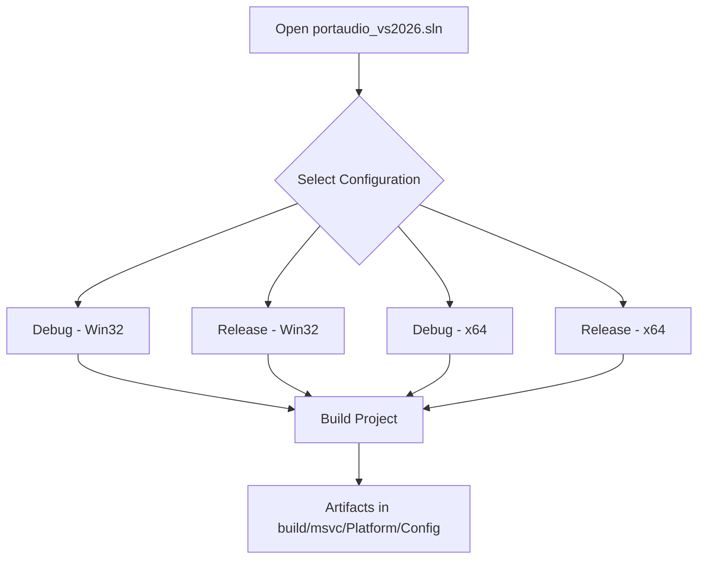

# Installation – Build PortAudio DLLs

This section guides you through compiling the PortAudio library and deploying its runtime DLLs for both Win32 and x64 targets in Debug and Release configurations. Follow these steps to ensure the main application can locate and load the correct PortAudio binaries.

---

## Prerequisites

- **Visual Studio 2022 (or later)** with C++ desktop development workload.
- **Windows 10 SDK** installed and accessible by Visual Studio.
- **Git** clone or download of the repository, which includes PortAudio under `lib-src/portaudio-2021`.

---

## 1. Locate the PortAudio Project

Navigate to the embedded PortAudio source and solution:

```bash
cd <repo-root>/lib-src/portaudio-2021/portaudio_vs2026
```

Here you will find `portaudio_vs2026.sln` and accompanying project files configured for Win32/x64 platforms.

---

## 2. Build Configurations

Open `portaudio_vs2026.sln` in Visual Studio. For each of the four target combinations, compile the project:

| Configuration | Platform | Output DLL |
| --- | --- | --- |
| Debug | Win32 | `portaudio_x86.dll` |
| Release | Win32 | `portaudio_x86.dll` |
| Debug | x64 | `portaudio_x64.dll` |
| Release | x64 | `portaudio_x64.dll` |


- In **Solution Explorer**, right-click the **portaudio** project → **Properties** to confirm the **Output Directory** is set to `build\msvc\<Platform>\<Configuration>\`.
- Build each one via **Build** → **Build Solution** or by selecting the desired **Configuration/Platform** in the toolbar and pressing **F7**.



---

## 3. Copying the DLLs

Once built, you must copy each DLL into two locations:

1. **Root application folder**
2. **Configuration-specific output folder** (`.\Debug\`, `.\Release\`, `.\x64\Debug\`, `.\x64\Release\`)

Below is a summary table of source and destinations:

| Variant | Source Path | Destinations |
| --- | --- | --- |
| Win32 Debug | `.../build/msvc/Win32/Debug/portaudio_x86.dll` | `.\portaudio_x86.dll` <br/> `.\Debug\portaudio_x86.dll` |
| Win32 Release | `.../build/msvc/Win32/Release/portaudio_x86.dll` | `.\Release\portaudio_x86.dll` |
| x64 Debug | `.../build/msvc/x64/Debug/portaudio_x64.dll` | `.\portaudio_x64.dll` <br/> `.\x64\Debug\portaudio_x64.dll` |
| x64 Release | `.../build/msvc/x64/Release/portaudio_x64.dll` | `.\x64\Release\portaudio_x64.dll` |


A convenient reference of typical copy commands is provided in **portaudio-dlls_getcopy.txt**:

```bash
# Copy Win32 Debug
copy .\lib-src\portaudio-2021\portaudio_vs2026\build\msvc\Win32\Debug\portaudio_x86.dll .\portaudio_x86.dll
copy .\lib-src\portaudio-2021\portaudio_vs2026\build\msvc\Win32\Debug\portaudio_x86.dll .\Debug\portaudio_x86.dll

# Copy Win32 Release
copy .\lib-src\portaudio-2021\portaudio_vs2026\build\msvc\Win32\Release\portaudio_x86.dll .\Release\portaudio_x86.dll

# Copy x64 Debug
copy .\lib-src\portaudio-2021\portaudio_vs2026\build\msvc\x64\Debug\portaudio_x64.dll .\portaudio_x64.dll
copy .\lib-src\portaudio-2021\portaudio_vs2026\build\msvc\x64\Debug\portaudio_x64.dll .\x64\Debug\portaudio_x64.dll

# Copy x64 Release
copy .\lib-src\portaudio-2021\portaudio_vs2026\build\msvc\x64\Release\portaudio_x64.dll .\x64\Release\portaudio_x64.dll
```

These commands illustrate the **source** and **destination** paths for all four builds.

---

## 4. Verification ✅

After copying:

- Inspect the root and each configuration folder to ensure the DLLs appear.
- Launch the application; if PortAudio fails to initialize, double-check the filenames and locations.

```bash
dir .\*.dll   # should list portaudio_x86.dll and portaudio_x64.dll
dir .\Debug\  # should list portaudio_x86.dll
dir .\x64\Release\  # should list portaudio_x64.dll
```

---

> **Tip** Always rebuild PortAudio when changing the host API or after upgrading Visual Studio to avoid binary mismatches. Use consistent paths to simplify automation scripts.