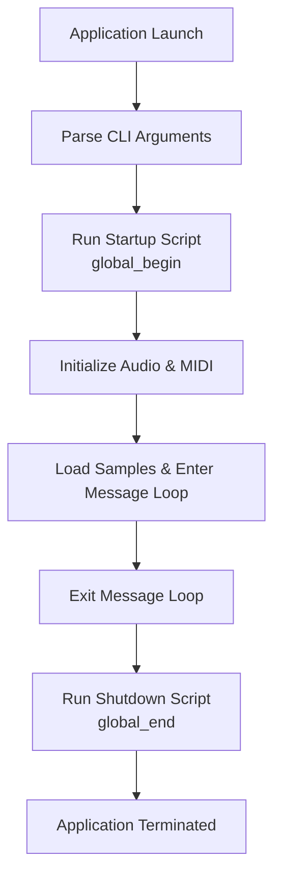

# Installation – Optional External Tools

The Spitonic MIDI Sampler can invoke external scripts or commands at **startup** and **shutdown**, enabling you to integrate utilities like AutoHotkey into your workflow. This section explains how to configure and use these hooks.

## 🎯 Purpose

- Allow users to automate environment setup before the sampler starts.
- Cleanup or restore system state after the sampler exits.
- Seamlessly integrate third-party tools (e.g., AutoHotkey, custom batch scripts).

## Configuration Variables

The application exposes two global string variables:

| Variable | Purpose | Default Value | CLI Override Position |
| --- | --- | --- | --- |
| **global_begin** | Command or script run **before** initialization | begin.ahk | 22nd argument |
| **global_end** | Command or script run **after** shutdown | end.ahk | 23rd argument |


These are defined alongside other globals in the codebase  and can be overridden on launch .

## How It Works

1. **Parsing Arguments**

The WinMain entry reads command-line parameters. If provided, the 22nd and 23rd arguments replace the defaults for `global_begin` and `global_end`.

1. **Startup Hook**

Immediately after parsing, the application calls:

```cpp
   ShellExecuteA(
     NULL,
     "open",
     global_begin.c_str(),
     "",
     NULL,
     nCmdShow
   );
```

This launches your **startup script** (default `begin.ahk`) via the Windows shell .

1. **Main Operation**

The sampler initializes audio (PortAudio), MIDI, Tonic, loads samples, and enters the Windows message loop.

1. **Shutdown Hook**

On application exit (e.g., in `WM_DESTROY` or just before `return` in `WinMain`), a similar call executes your **shutdown script**:

```cpp
   ShellExecuteA(
     NULL,
     "open",
     global_end.c_str(),
     "",
     NULL,
     SW_HIDE
   );
```

This runs `end.ahk` (or your custom tool) to perform cleanup.

## Execution Flow



## Placing Your Scripts

- **Location:** Copy `begin.ahk`, `end.ahk`, or your custom scripts/binaries into the **same directory** as the sampler executable.
- **Naming:** Match the names or specify overrides via CLI.
- **Execution Context:** Scripts run with the sampler’s working directory; relative paths resolve correctly.

## Example: AutoHotkey Integration

1. Create `begin.ahk` next to `spitonic.exe`:

```autohotkey
   ; begin.ahk
   Run, C:\Windows\System32\SoundRecorder.exe
   Send, {Volume_Up 2}
```

1. Create `end.ahk`:

```autohotkey
   ; end.ahk
   Send, {Volume_Down 2}
   ExitApp
```

1. Launch sampler (overriding defaults):

```bash
   spitonic.exe [other args] custom_start.bat custom_cleanup.bat
```

## Tips & Best Practices

- Use **absolute paths** in your scripts to avoid ambiguity.
- Test your scripts independently before integrating.
- For **silent execution**, wrap commands in batch files and use `SW_HIDE` mode.
- Ensure your tools are in **PATH** or specify full paths.

By following these steps, you can hook any external automation into the Spitonic MIDI Sampler’s lifecycle, improving productivity and customizing your environment to your needs.