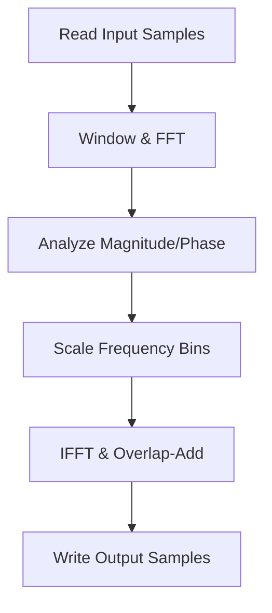

# Pitch Shifting and Advanced Sample Processing

This section describes the high-quality, duration-preserving pitch-shift algorithm included in the sampler. It leverages Stephan M. Bernsee’s **smbPitchShift** routine, based on a Short-Time Fourier Transform (STFT), to transpose audio samples by fractional semitones while maintaining their original length.

## smbPitchShift Routine

The core pitch-shift implementation accepts raw audio buffers and applies STFT-based processing in five stages: input buffering, windowing, analysis, frequency-domain scaling, and synthesis.

**Location:** `smbPitchShift.h`

```cpp
void smbPitchShift(
    float pitchShift,           // 0.5 (one octave down) … 2.0 (one octave up)
    long numSampsToProcess,     // number of samples in indata/outdata
    long fftFrameSize,          // FFT size (power of two: 1024, 2048, 4096)
    long osamp,                 // STFT oversampling factor (4–32 recommended)
    float sampleRate,           // sample rate in Hz (e.g., 44100.0)
    float *indata,              // input buffer, floating-point [-1.0,1.0)
    float *outdata              // output buffer, floating-point [-1.0,1.0)
);
```

### Parameter Reference

| Parameter | Type | Description | Typical Value |
| --- | --- | --- | --- |
| **pitchShift** | float | Pitch scaling factor: 0.5–2.0 (1.0 = no shift) | 0.5–2.0 |
| **numSampsToProcess** | long | Number of samples to process in input/output buffers | sample length |
| **fftFrameSize** | long | FFT frame size (power of two, ≤ MAX_FRAME_LENGTH) | 1024, 2048, 4096 |
| **osamp** | long | Oversampling factor; determines STFT frame overlap | 4–32 |
| **sampleRate** | float | Audio sample rate in Hz | 44100.0 |
| **indata** | float* | Pointer to input samples (must be normalized to [-1.0,1.0)) | — |
| **outdata** | float* | Pointer to output buffer; may alias indata for in-place processing | — |


## Thread-Safe Variant

To support up to 16 concurrent pitch-shift operations (one per MIDI module), the sampler provides a **thread-safe** wrapper that partitions internal buffers by module index.

**Location:** `smbPitchShift.cpp`

```cpp
#define MAX_CONCURRENT_SMBPITCHSHIFT 16

void smbPitchShift_threadsafe(
    int midimoduleindex,  // 0…15, selects internal buffer set
    float pitchShift,
    long numSampsToProcess,
    long fftFrameSize,
    long osamp,
    float sampleRate,
    float* indata,
    float* outdata
);
```

- **Buffer Partitioning**: Uses per-index FIFOs, work buffers, phase arrays, and accumulators.
- **Safety**: Assert if `midimoduleindex` out of range; only 16 concurrent calls allowed.

## Processing Workflow

The algorithm processes each buffer in a loop of `numSampsToProcess` samples:

1. **Input FIFO**: Append new samples and output oldest ones.
2. **Windowing & Interleaving**: Apply Hann-like window to frame.
3. **FFT Analysis**: Compute spectrum (`smbFft`), extract magnitudes and phases.
4. **Frequency Scaling**: Shift spectral bins by `pitchShift` factor, remap magnitudes and frequencies.
5. **IFFT Synthesis**: Inverse FFT, overlap-add frames into output buffer.



## Integration in the Sampler

Within `pitchshift(...)`, the application:

- Loads a `WavSet` from existing sample data.
- Splits it into left/right channels.
- Computes a **semitone difference** and converts it to `pitchShift = pow(2.0, semitones/12.0)`.
- Calls **smbPitchShift_threadsafe** on each channel.
- Recombines channels into a new `WavSet` and caches it in `global_ppbuffer`.

```cpp
float pitchShift = pow(2.0, semitones/12.0);
// Thread-safe pitch shift on left channel
smbPitchShift_threadsafe(
    global_samplermodulesindex,
    pitchShift,
    myLeftWavSet.numSamples,
    2048, 4,
    44100.0f,
    myLeftWavSet.pSamples,
    myLeftWavSet.pSamples
);
// …same for right channel, then recombine… 
```

(Location: pitch-shift wrapper)

## Configuration Tips and Best Practices

```card
{
    "title": "Quality vs. Latency",
    "content": "Use higher osamp (\u226516) for cleaner pitch shifts; lower osamp (4\u20138) for reduced CPU usage."
}
```

- **FFT Frame Size**: Larger frames (4096) yield smoother results on low-frequency transpositions.
- **Normalization**: Ensure input samples are scaled to [-1.0, 1.0) to prevent clipping.
- **Concurrency**: Use the thread-safe variant if multiple modules pitch-shift simultaneously.
- **Latency**: Total processing latency ≈ fftFrameSize/osamp samples; account for this in live playback.

## Advanced Usage

- You can call **smbPitchShift** directly for single-threaded, in-place sample tweaks.
- For real-time MIDI-driven pitch shift, always route audio through PortAudio with minimal buffer sizes and apply pitch shifting per note.

---

By understanding this routine’s parameters and pipeline, you can finely control pitch transposition in your MIDI sampler, maintaining original timing while achieving smooth, artifact-free shifts.