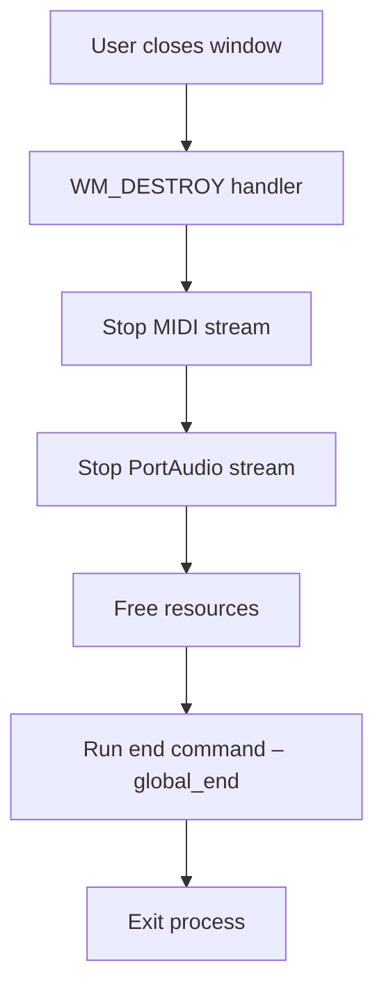

# Running the Application – Shutting Down

When the user closes the main window (or chooses Exit), the application enters its shutdown sequence. This ensures all audio and MIDI streams stop cleanly, resources are freed, and any external tools you’ve chained in are reset via your configured **end command**.

## Shutdown Workflow

A high-level overview of the shutdown steps:



## WM_DESTROY Handler

Inside your window procedure (`WndProc`), the `WM_DESTROY` case implements shutdown:

```cpp
case WM_DESTROY:
    // 1) Terminate PortMIDI
    global_active = false;
    Pm_Close(global_pPmStreamMIDIIN);
    Pt_Stop();
    Pm_Terminate();
    // 2) Terminate PortAudio
    mySPIAudioDevice.global_err = Pa_StopStream(global_stream);
    if (mySPIAudioDevice.global_err != paNoError) { /* error handling */ }
    mySPIAudioDevice.global_err = Pa_CloseStream(global_stream);
    if (mySPIAudioDevice.global_err != paNoError) { /* error handling */ }
    Pa_Terminate();
    // 3) Free all loaded samples, memory, timers, and image buffers
    for (int i = 0; i < global_numberofsamplermodules; i++)
        unloadSynthSamples(i);
    // …close files, kill timers, unload FreeImage…
    // 4) Run configured end command
    ShellExecuteA(NULL, "open", global_end.c_str(), "", NULL, 0);
    // 5) Quit message loop
    PostQuitMessage(0);
    break;
```

– excerpt from `WndProc` shutdown logic

## Key Responsibilities

| Step | Purpose |
| --- | --- |
| **Terminate MIDI** | Closes the PortMIDI input stream (`Pm_Close`), stops the PortMIDI thread (`Pt_Stop`), and finalizes PortMIDI (`Pm_Terminate`). |
| **Terminate Audio** | Stops (`Pa_StopStream`) and closes (`Pa_CloseStream`) the PortAudio stream, then calls `Pa_Terminate` to shut down the audio engine. |
| **Free Resources** | Unloads all sample buffers (`unloadSynthSamples`), closes debug/log files, kills multimedia timers, and unloads images/fonts. |
| **Run End Command** | Executes your **global_end** command (default `end.ahk`) via `ShellExecuteA`. This allows custom teardown of external tools (virtual audio cables, loopback setups). |
| **Exit Process** | Calls `PostQuitMessage(0)` to end the Win32 message loop and let `main` return. |


## Configuring Your End Command

- The string `global_end` holds the path or command to run on exit.
- By default, it is set to `"end.ahk"`, which will launch the AutoHotkey script `end.ahk` in your application folder .
- You can override this at runtime (for example via a settings dialog or command-line flag) to point to any executable or script:

```cpp
  global_end = "C:\\MyScripts\\reset_routing.bat";
```

## Practical Tips

- ✨ **Automate teardown** of virtual audio cables or loopback devices by writing an AHK, BAT, or PowerShell script.
- 🛠️ Verify your end script path; if it’s not in the working directory, supply an absolute path.
- 📄 Use `ShellExecuteA` parameters (last argument) to control window visibility:
- `0` = hide window
- `SW_SHOW` = show window

---

By following this shutdown routine, the sampler instrument leaves no dangling streams or memory leaks, and it seamlessly invokes your external teardown script to restore your environment.