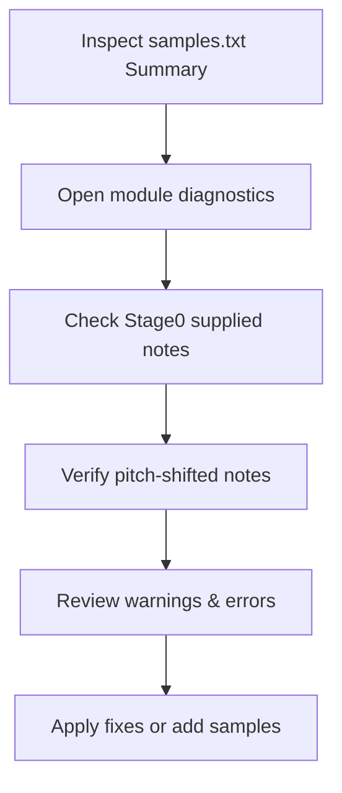

# Troubleshooting and Logs – Sample Loading Diagnostics

This section explains how to diagnose sample-loading issues in the Win32 C++ MIDI sampler. Each run generates a **summary log** (`samples.txt`) and detailed **per-module logs** (`samples_modid0.txt`, `samples_modid1.txt`, …). Use these logs to confirm that MIDI notes are mapped to samples correctly and that durations load as expected.

---

## Log Files Overview

After launching the application, two types of log files are created:

| File Name | Purpose |
| --- | --- |
| **samples.txt** | Summary of how many sampler modules will load, with module IDs and folder paths. |
| **samples_modidX.txt** | Detailed diagnostics for module `X`: note discoveries, pitch-shifting stages, warnings. |


Each file is created at startup:

- `samples.txt` is opened for single-core mode via `pFILE2 = fopen("samples.txt","w")` .
- `samples_modidX.txt` files are opened per module index via `pFILEarray[i] = fopen("samples_modid<i>.txt","w")` .

---

## samples.txt – Module Loading Summary

This file shows:

- Total number of sampler modules.
- For each module:
- **Module ID** (also used as MIDI channel).
- **Samples folder path**.

**Example snippet** from `samples.txt`:

```bash
will load 3 sampler module(s)
**********************************************************************************************************************
module id 0 on midi channel id 0
loading samples in C:\Samples\Piano
**********************************************************************************************************************
module id 1 on midi channel id 1
loading samples in C:\Samples\Strings
**********************************************************************************************************************
module id 2 on midi channel id 2
loading samples in C:\Samples\Brass
```

Key Points:

- Confirm the **number of modules** matches your configuration.
- Verify each **folder path** is correct and accessible.

---

## samples_modidX.txt – Module Detailed Diagnostics

Each module-specific log includes:

1. **Module Header**
2. **Sample-name to MIDI-note mapping**
3. **Stage-by-stage note-supply lists**
4. **Pitch-shifting events**
5. **Warnings and errors**

### 1. Module Header

At the top of each `samples_modidX.txt`:

```bash
**********************************************************************************************************************
module id X on midi channel id X
loading samples in <folder_path>
**********************************************************************************************************************
```

Use this to confirm the module index and folder path.

### 2. Sample-name to MIDI-note Mapping

For each file discovered, the code logs whether a valid MIDI note was found:

```c
if (midinote<0 || midinote>127) {
    fprintf(pFILE2, "error, midinote %d unknown for sample name %s\n", midinote, filename);
    exit(1);
} else {
    fprintf(pFILE2, "success, found midinote %d for sample name %s\n", midinote, filename);
}
```

- `**success, found midinote …**` confirms correct note detection.
- `**error, midinote … unknown**` indicates filename parsing failed.

### 3. Stage-by-Stage Note Supply

The sampler fills gaps by pitch-shifting nearest samples in multiple **stages**. Each stage logs the **global_suppliedmidinotes** list:

```bash
(stage 0) global_suppliedmidinotes for module index X
60,64,67

(stage 1) global_suppliedmidinotes for module index X
60,62,64,65,67
```

- **Stage 0**: notes directly supplied by actual samples.
- **Subsequent stages**: include notes filled by pitch-shifting.

### 4. Pitch-Shifting Events

When gaps exist, the sampler reports each pitch-shift operation:

```bash
pitchshifted midinote 62 from referencemidinote 60
pitchshifted midinote 65 from referencemidinote 67
```

Check these lines to ensure gaps are filled within ±12 semitones.

### 5. Warnings and Errors

⚠️ Common log entries:

- **Duplicate samples**:

`warning, detected more than one sample for midinote 64`

- **Silence fallback**:

`warning, sample silence for midinote 61`

- **Out-of-range notes**:

`error, midinote -1 unknown for sample name …`

Investigate any warnings to avoid unexpected silences or overlaps.

---

## How to Interpret and Diagnose

Follow these steps when notes do not sound as expected:

1. **Inspect **`**samples.txt**`
2. Confirm the number of modules and correct folder paths.

1. **Open the relevant **`**samples_modidX.txt**`
2. Check the **Module Header** for the correct module index.

1. **Verify direct sample mapping**
2. Ensure each expected note appears in the **stage 0** list.

1. **Review pitch-shift operations**
2. Check that all missing notes were pitch-shifted from nearby reference notes.

1. **Identify warnings**
2. **Duplicates** may cause unpredictable behavior.
3. **Silence fallbacks** indicate missing samples beyond pitch-shift range.

1. **Confirm durations**
2. Although not explicitly logged, confirm that durations (`global_sampleduration_s`) align with your sample rates and lengths.

---

## Common Issues & Solutions

| Issue | Cause | Resolution |
| --- | --- | --- |
| Missing notes | No WAV file or misnamed file | Verify filename conventions and folder structure. |
| Pitch-shift too large (>12 semitones) | Gaps exceed allowable pitch range | Add additional samples or change mapping to reduce gaps. |
| Duplicate sample warnings | Two files mapping to same note | Remove or rename duplicate files. |
| Silence fallback for some notes | No sample and pitch shift failed | Provide a small WAV for missing notes or adjust pitch-shift range. |
| Incorrect sample durations (too short/long) | Sample rate mismatch or corrupted file | Use a known good WAV and confirm its sample rate. |


---

## Diagnostic Workflow Diagram



Use this workflow to systematically pinpoint and resolve sample-loading issues.

---

By closely examining `samples.txt` and `samples_modidX.txt`, you can ensure that your MIDI sampler maps and plays each note correctly, with clear insights into any gaps, overlaps, or file errors.