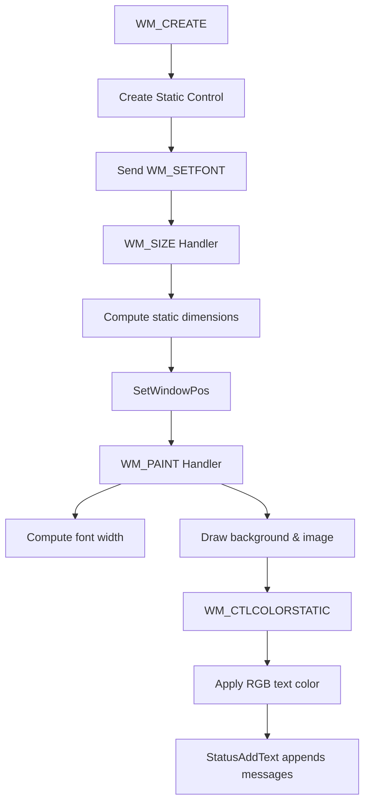

# User Interface and Window Configuration – Text Display and Font Settings

This section explains how status messages are displayed in the main static text area and how you can configure text font, color, and alignment. These settings ensure clear, readable output—even when embedding the window into custom desktop dashboards.

## Static Text Control Creation 📝

When the window is created, a transparent static control is instantiated to host status messages.

```cpp
// In WndProc, case WM_CREATE
HWND hStatic = CreateWindowEx(
    WS_EX_TRANSPARENT,
    L"STATIC",
    L"",
    WS_CHILD | WS_VISIBLE | global_staticalignment,
    0, 100, 100, 100,
    hWnd,
    (HMENU)IDC_MAIN_STATIC,
    GetModuleHandle(NULL),
    NULL
);
SendMessage(hStatic, WM_SETFONT, (WPARAM)global_hFont, MAKELPARAM(FALSE, 0));
```

- **CreateWindowEx** uses `global_staticalignment` to set left, center, or right text alignment.
- **WM_SETFONT** applies the font created from `global_fontheight`.

## Global Font and Color Parameters

Customize text appearance using these global variables; they can be overridden via command-line arguments.

| Parameter | Type | Default | Description |
| --- | --- | --- | --- |
| **global_fontheight** | int | 24 | Logical font height in pixels. |
| **global_fontcolor_r** | BYTE | 255 | Red component of text color (0–255). |
| **global_fontcolor_g** | BYTE | 255 | Green component of text color (0–255). |
| **global_fontcolor_b** | BYTE | 255 | Blue component of text color (0–255). |
| **global_staticalignment** | int | 0 | Text alignment: `0`=left, `1`=center, `2`=right. |


These defaults ensure white, left-aligned text at 24 px height .

## Measuring Font Dimensions

The **WM_PAINT** handler computes the average character width at runtime. This lets the layout adapt to different fonts or DPI settings.

```cpp
case WM_PAINT:
    hdc = BeginPaint(hWnd, &ps);
    SelectObject(hdc, global_hFont);
    TEXTMETRIC tm;
    GetTextMetrics(hdc, &tm);
    global_fontwidth = tm.tmAveCharWidth;
    // … render background and image …
    EndPaint(hWnd, &ps);
    break;
```

- **GetTextMetrics** fills `tmAveCharWidth`, stored in `global_fontwidth`.
- This width drives text wrapping and control sizing.

## Dynamic Static Control Sizing

In **WM_SIZE**, the control resizes to fill the client area, maintaining consistent layout:

```cpp
case WM_SIZE:
    RECT rc;
    GetClientRect(hWnd, &rc);
    global_staticwidth  = rc.right  - rc.left;
    global_staticheight = rc.bottom - rc.top;
    SetWindowPos(
        GetDlgItem(hWnd, IDC_MAIN_STATIC),
        NULL,
        0, 0,
        global_staticwidth,
        global_staticheight,
        SWP_NOZORDER
    );
    break;
```

- **global_staticwidth/height** match the full window client size.
- After resizing, status text wraps automatically based on `global_fontwidth`.

## Text Alignment Control

The **global_staticalignment** parameter maps directly to static control styles:

| Value | Style | Description |
| --- | --- | --- |
| 0 | SS_LEFT | Left-aligned text |
| 1 | SS_CENTER | Centered text |
| 2 | SS_RIGHT | Right-aligned text |


Adjust this at startup (argument index 18) to fit different dashboard layouts.

## Coloring the Text

When Windows draws static text, the **WM_CTLCOLORSTATIC** handler sets the background transparent and applies the configured RGB color:

```cpp
case WM_CTLCOLORSTATIC: {
    HDC hdcStatic = (HDC)wParam;
    SetBkMode(hdcStatic, TRANSPARENT);
    SetTextColor(
        hdcStatic,
        RGB(global_fontcolor_r,
            global_fontcolor_g,
            global_fontcolor_b)
    );
    return (INT_PTR)GetStockObject(NULL_PEN);
}
```

This ensures status messages blend seamlessly with any background.

## Appending Status Messages

The helper macro **StatusAddText** appends formatted strings to the static control’s buffer:

```cpp
// Example usage on key or mouse events
swprintf(pWCHAR, L"Input channel set to %d\n", global_inputmidichannel);
StatusAddText(pWCHAR);
```

- Messages are queued in a global text buffer and redrawn automatically.
- Use wide (Unicode) or ANSI variants depending on the build.

```card
{
    "title": "Tip",
    "content": "On high-DPI monitors, increase global_fontheight to maintain legibility."
}
```

## Rendering Flowchart



This flow shows how the control is created, sized, and rendered to display status updates.

---

By tuning these parameters—**font height**, **colour**, and **alignment**—you gain full control over readability and integration when embedding the sampler’s window into any custom dashboard.