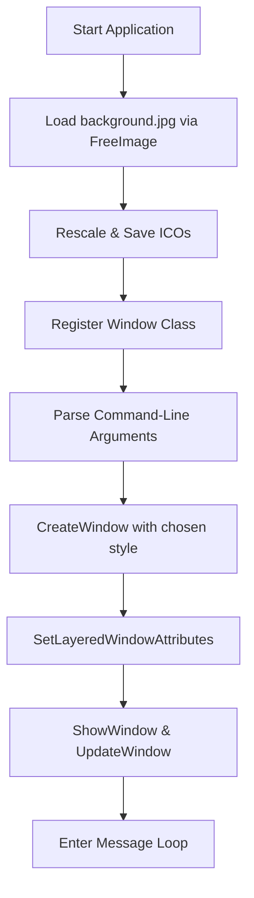

# User Interface and Window Configuration

This section details how the main Win32 GUI window’s geometry and appearance are defined, configured, and updated. It covers command-line overrides, transparency, title bar toggling, background image loading, icon generation, and dynamic resizing.

## Global Configuration Variables

The application exposes several global variables to control window geometry, transparency, and appearance. These are initialized with defaults and can be overridden by command-line arguments.

| Variable | Default | Purpose |
| --- | --- | --- |
| **global_x**, **global_y** | 100, 200 | Window top-left position (pixels) |
| **global_xwidth**, **global_yheight** | 400, 400 | Window size (width × height in pixels) |
| **global_alpha** | 200 | Window transparency (0–255; 255 = opaque) |
| **global_titlebardisplay** | 1 | Show title bar (1 = on, 0 = off) |
| **global_menubardisplay** | 0 | Show menu bar (1 = on, 0 = off) |
| **global_staticwidth**, **global_staticheight** | –1 | Control area size; computed on resize |
| **global_imagewidth**, **global_imageheight** | –1 | Background image area; computed on resize |


These defaults come from the top of the main source file .

## Command-Line Arguments

Users can override the above globals via positional command-line parameters. The parser assigns:

| Arg Index | Variable | Description |
| --- | --- | --- |
| 6 | global_x | X position |
| 7 | global_y | Y position |
| 8 | global_xwidth | Window width |
| 9 | global_yheight | Window height |
| 10 | global_alpha | Transparency (0–255) |
| 11 | global_titlebardisplay | Title bar (1 = on, 0 = off) |
| 12 | global_menubardisplay | Menu bar (1 = on, 0 = off) |


```cpp
if (nArgs > 6)  global_x             = atoi(szArgList[6]);
if (nArgs > 7)  global_y             = atoi(szArgList[7]);
if (nArgs > 8)  global_xwidth        = atoi(szArgList[8]);
if (nArgs > 9)  global_yheight       = atoi(szArgList[9]);
if (nArgs > 10) global_alpha         = atoi(szArgList[10]);
if (nArgs > 11) global_titlebardisplay = atoi(szArgList[11]);
if (nArgs > 12) global_menubardisplay  = atoi(szArgList[12]);
```

This mapping is implemented in the argument parsing block .

## Window Class Registration

Before creating the window, the application registers a Win32 class that defines its icons, background brush, and menu presence.

- **hIconSm** is loaded from the scaled 16×16 icon file.
- **hbrBackground** uses the default window color.
- **lpszMenuName** is set based on **global_menubardisplay**.

```cpp
wcex.hbrBackground = (HBRUSH)(COLOR_WINDOW + 1);
wcex.lpszMenuName  = global_menubardisplay
                     ? MAKEINTRESOURCE(IDC_SPIWAVWIN32)
                     : NULL;
wcex.lpszClassName = szWindowClass;
wcex.hIconSm       = (HICON)LoadImage(
    NULL,
    L"background_16x16x16.ico",
    IMAGE_ICON, 0, 0,
    LR_LOADFROMFILE
);
RegisterClassEx(&wcex);
```

## Main Window Creation

In `InitInstance`, the window is created using either `WS_OVERLAPPEDWINDOW` or `WS_POPUP` depending on **global_titlebardisplay**. Immediately after, the window is made layered and its alpha value is applied.

```cpp
// Load background for icon generation
global_dib = FreeImage_Load(FIF_JPEG, "background.jpg", JPEG_DEFAULT);
// Generate and save 16×16, 32×32, 48×48 icons (omitted)

// Choose window style
DWORD style = global_titlebardisplay
              ? WS_OVERLAPPEDWINDOW
              : WS_POPUP | WS_VISIBLE;

// Create main window
hWnd = CreateWindow(
    szWindowClass, szTitle,
    style,
    global_x, global_y,
    global_xwidth, global_yheight,
    NULL, NULL, hInstance, NULL
);

// Enable layered style for transparency
SetWindowLong(
    hWnd, GWL_EXSTYLE,
    GetWindowLong(hWnd, GWL_EXSTYLE) | WS_EX_LAYERED
);
SetLayeredWindowAttributes(
    hWnd, 0, global_alpha, LWA_ALPHA
);

ShowWindow(hWnd, nCmdShow);
UpdateWindow(hWnd);
```

## Background Image and Icon Generation

The background JPEG is loaded at startup and used both as the UI background and to generate application icons:

1. **Load** `background.jpg` via FreeImage.
2. **Rescale** to 16×16, 32×32, 48×48.
3. **Save** each as ICO files.
4. **Unload** temporary bitmaps.

```cpp
global_dib =
  FreeImage_Load(FIF_JPEG, "background.jpg", JPEG_DEFAULT);

auto ico16 = FreeImage_Rescale(global_dib, 16, 16, FILTER_BICUBIC);
FreeImage_Save(FIF_ICO, ico16, "background_16x16xrgb-new.ico");
FreeImage_Unload(ico16);

// Repeat for 32×32 and 48×48...
FreeImage_Unload(global_dib);
```

Icons reflect the **AUDIO_SPI** branding and are later loaded in `MyRegisterClass`.

## Handling Window Resizing

When the window is resized (including on creation), the `WM_SIZE` handler recomputes both control and image dimensions. A static child control is repositioned to fill the client area, and the audio visualization library is reinitialized with the new size.

```cpp
case WM_SIZE: {
  RECT rc;
  GetClientRect(hWnd, &rc);

  global_staticwidth  = rc.right;
  global_staticheight = rc.bottom;
  global_imagewidth   = rc.right;
  global_imageheight  = rc.bottom;

  // Reinitialize drawing area
  WavSetLib_Initialize(
    global_hwnd, IDC_MAIN_STATIC,
    global_staticwidth, global_staticheight,
    global_fontwidth, global_fontheight,
    global_staticalignment, global_pfile
  );

  // Resize static control
  SetWindowPos(
    GetDlgItem(hWnd, IDC_MAIN_STATIC),
    NULL, 0, 0,
    global_staticwidth, global_staticheight,
    SWP_NOZORDER
  );
}
```

## Initialization Flowchart



This flow highlights the **window geometry** and **appearance** setup, ensuring a consistent, user-configurable UI.

---

By following these mechanisms, users can position, size, and style the main application window to fit their desktop environment, enable or disable chrome, and control transparency for an optimal MIDI sampling experience.