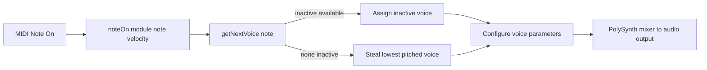

# Using MIDI and Playing Instruments – Polyphonic Voice Allocation 🎹

Polyphony allows multiple notes to sound simultaneously. In **spitonicmidiinstrumentpolysamplers**, each sampler module uses a dedicated **PolySynth** configured with a fixed number of voices. When you press many keys at once, the system intelligently manages voice limits to ensure smooth playback.

## Voice Configuration

Every sampler module is backed by its own `PolySynth` instance, which allocates a pool of voices at startup:

| Constant | Description | Default Value |
| --- | --- | --- |
| ------------------------------- | ------------------------------------------------ | --------------: |
| **SPITMIPS_NUMBEROFVOICES** | Number of simultaneous voices per module | 16 |
| **PolySynth** | Alias for `PolySynthWithAllocator<LowestNoteStealingPolyphonicAllocator>` | Defined in PolySynth.h |


```cpp
// In global variables (PolySynth_main.cpp)
const int SPITMIPS_NUMBEROFVOICES = 16; 
...
poly[moduleIndex].addVoices(createSynthVoice, SPITMIPS_NUMBEROFVOICES);
```

## Allocation Strategy ⚙️

Voice allocation follows these rules:

- **Inactive voices** are used first (voices not currently playing).
- If no inactive voice remains, the **lowest-pitched active note** is stolen.
- This prevents abrupt cut-offs and suits multi-sampled acoustic instruments.

### Inactive vs. Active Voices

- **Inactive Voice**
- Not producing sound
- Awaiting next assignment

- **Active Voice**
- Currently playing a note
- Tracked in `activeVoiceQueue`

### Note-On Flow



1. **Receive** MIDI note on event.
2. **Query** `getNextVoice(note)`.
3. **Assign** an inactive voice or steal the lowest-pitched one.
4. **Set** Tonic parameters:
5. `polyNote`
6. `polyGate`
7. `polyVelocity`
8. `polyVoiceNumber`
9. **Activate** voice in mixer for audio rendering.

### Note-Off Flow

1. **Receive** MIDI note off event.
2. **Search** `activeVoiceQueue` for the matching note.
3. **Set** `polyGate` to 0.0 on that voice.
4. **Move** voice back to `inactiveVoiceQueue`.

## Implementation Details

- **BasicPolyphonicAllocator**
- Manages voice queues (`inactiveVoiceQueue`, `activeVoiceQueue`).
- Implements `addVoice`, `noteOn`, `noteOff`, and default `getNextVoice`.

- **LowestNoteStealingPolyphonicAllocator**
- Overrides `getNextVoice` to steal the lowest-pitched active voice if needed.
- Core algorithm:

```cpp
int LowestNoteStealingPolyphonicAllocator::getNextVoice(int note){
    int voice = BasicPolyphonicAllocator::getNextVoice(note);
    if (voice >= 0)
        return voice;
    int lowestNote = note;
    int lowestVoice = -1;
    for (int voiceNumber : activeVoiceQueue)
    {
        PolyVoice& v = voiceData[voiceNumber];
        if (v.currentNote < lowestNote)
        {
            lowestNote = v.currentNote;
            lowestVoice = voiceNumber;
        }
    }
    return lowestVoice;
}
```

- **PolySynthWithAllocator**
- Template class combining a Tonic `Synth`, a `Mixer`, and a `VoiceAllocator`.
- Methods:
- `addVoices(createFn, count)`
- `noteOn(moduleId, note, velocity)`
- `noteOff(note)`

## Best Practices for End Users

- 🎵 **Avoid excessive layering**: Stay within 80–120% of the voice count to minimize stealing.
- ⚙️ **Adjust voice count**: If needed, recompile with a higher `SPITMIPS_NUMBEROFVOICES`.
- 🔊 **Monitor CPU load**: More voices increase CPU usage. Balance voice count with performance.
- 🎶 **Use legato carefully**: Overlapping notes may steal earlier sustained notes.

```card
{
    "title": "Voice Stealing",
    "content": "When all voices are busy, the lowest note is released to play new notes."
}
```

By understanding this voice allocation mechanism, you can configure and play complex chords and overlapping phrases without unexpected audio drop-outs.