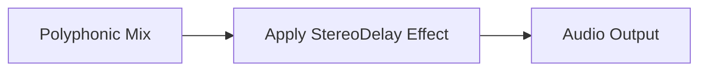

## Using MIDI and Playing Instruments – Stereo Delay and Effects

The **StereoDelay** effect from the Tonic library is applied after all polyphonic voices have been mixed. It creates a subtle sense of space by introducing independent left/right delay times, moderate feedback, and a controllable wet/dry mix. By default, low-frequency sine waves gently modulate the delay times, keeping the effect evolving over time without external processing.

### Default StereoDelay Configuration

Below are the built-in parameters for the StereoDelay effect in the sampler’s main setup:

| Parameter | Description | Default Value |
| --- | --- | --- |
| **delayTimeLeft** | Base delay for left channel (seconds) | 0.25 + SineWave(0.2 Hz) × 0.01 |
| **delayTimeRight** | Base delay for right channel (seconds) | 0.30 + SineWave(0.23 Hz) × 0.01 |
| **feedback** | Amount of signal fed back into the delay line | 0.4 |
| **dryLevel** | Level of the original (unaffected) signal | 0.8 |
| **wetLevel** | Level of the delayed signal | 0.2 |


### How It’s Applied in Code

After loading samples, mapping them to `poly` (a Tonic `PolySynth`), and summing all sampler modules, the effect is attached like this:

```cpp
#include "Tonic.h"
using namespace Tonic;

// ... after mixing poly voices for each module:
StereoDelay delay = StereoDelay(3.0f, 3.0f)
    .delayTimeLeft(  0.25 + SineWave().freq(0.2f)  * 0.01f )
    .delayTimeRight( 0.30 + SineWave().freq(0.23f) * 0.01f )
    .feedback(   0.4f )
    .dryLevel(   0.8f )
    .wetLevel(   0.2f );

synth.setOutputGen( synth.getOutputGen() >> delay );
```

(code excerpt from main setup)

### Adjusting or Disabling the Effect

- **Modify parameters:** Change base times, feedback, dry/wet levels by editing the values passed to `StereoDelay(...)`, or replace `SineWave()` modulation with constants.
- **Make dynamic controls:** Wrap any parameter in `addParameter(...)` to expose it via GUI or MIDI CC.
- **Disable dry/wet mix:** Set `.wetLevel(0.0f)` for a completely dry output or remove the `>> delay` operator to bypass the effect entirely.

### Processing Flowchart



### Tips and Best Practices

- 🎚️ **Balance wet/dry:** Keep `dryLevel` high for clarity; adjust `wetLevel` for space without clutter.
- 🔄 **Feedback caution:** Values > 0.5 can produce runaway echoes.
- 🌊 **Subtle modulation:** The LFO depth (`0.01`) prevents static delay times; feel free to increase for more movement.
- ⚙️ **Code maintenance:** Encapsulate delay setup in a function or class if you plan to switch or chain effects later.

By leveraging this built-in StereoDelay, the sampler delivers a polished, spatial sound out of the box, while still allowing deep customization or complete bypass when a dry signal path is preferred.