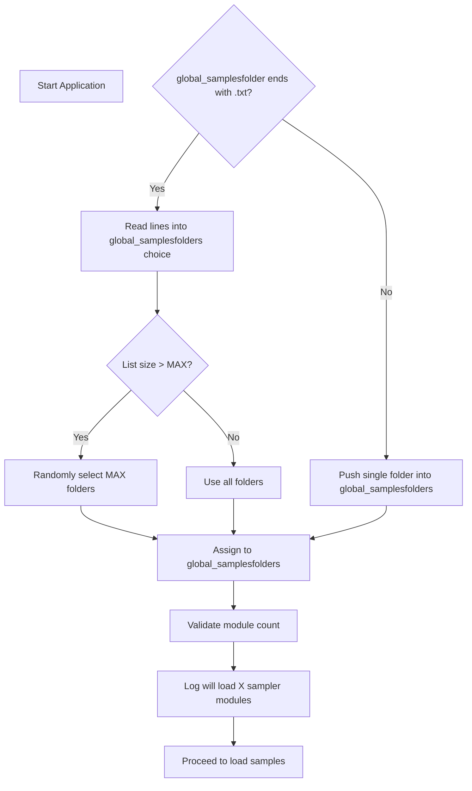

# Working with Sampler Modules and Samples – Loading Sample Folders 🗂️

This section explains how the application discovers and configures sampler modules by loading sample folders. It covers the role of **global_samplesfolder** and **global_samplesfilter**, how the folder list is assembled, module count validation, and logging.

## Configuration Parameters

These settings control which sample folders the application loads. They are typically provided via command-line arguments.

| Parameter | Description | Default |
| --- | --- | --- |
| **global_samplesfolder** | Path to a folder or a `.txt` file listing multiple folders (one per line). | `.` |
| **global_samplesfilter** | File pattern to match sample files within each folder (e.g. `*.wav`). | `*.wav` |


## Key Variables

- **global_samplesfolderschoice**

Temporary list of all folder paths read from a `.txt` file.

- **global_samplesfolders**

Final list of folder paths used to create sampler modules.

- **global_numberofsamplermodules**

Number of sampler modules to load; must be between 1 and `SPITMIPS_MAXNUMBEROFSAMPLERMODULES`.

- **SPITMIPS_MAXNUMBEROFSAMPLERMODULES**

Maximum allowed modules (compile-time constant).

## Loading Logic

1. **Detect **`**.txt**`** list vs. single folder**
2. If `global_samplesfolder` ends with `.txt`, the file is read line-by-line into `global_samplesfolderschoice`.
3. Otherwise, the single folder path is pushed into `global_samplesfolders`.

1. **Limit module count**
2. If the list size exceeds `SPITMIPS_MAXNUMBEROFSAMPLERMODULES`, random entries are selected until the limit is reached.
3. Else, the full list is used.

1. **Validate and assign**
2. `global_numberofsamplermodules = global_samplesfolders.size()`.
3. Assert that `1 ≤ global_numberofsamplermodules ≤ SPITMIPS_MAXNUMBEROFSAMPLERMODULES`.

1. **Log module count**
2. Writes a line like “will load 3 sampler module(s)” to `samples.txt`.
3. Example from a real session:

```text
     will load 3 sampler module(s)
```

## Example Code Snippet

```cpp
// Determine if we have a list file or a single folder
if (global_samplesfolder.rfind(".txt") != string::npos) {
    ifstream ifs(global_samplesfolder);
    string temp;
    while (getline(ifs, temp)) {
        global_samplesfolderschoice.push_back(temp);
    }
    // If too many entries, pick randomly up to the max allowed
    if (global_samplesfolderschoice.size() > SPITMIPS_MAXNUMBEROFSAMPLERMODULES) {
        while (global_samplesfolders.size() < SPITMIPS_MAXNUMBEROFSAMPLERMODULES) {
            global_samplesfolders.push_back(
                global_samplesfolderschoice[
                    RandomInt(0, global_samplesfolderschoice.size() - 1)
                ]
            );
        }
    } else {
        global_samplesfolders = global_samplesfolderschoice;
    }
} else {
    // Single folder case
    global_samplesfolders.push_back(global_samplesfolder);
}

// Finalize module count and validate
global_numberofsamplermodules = global_samplesfolders.size();
assert(global_numberofsamplermodules >= 1
       && global_numberofsamplermodules <= SPITMIPS_MAXNUMBEROFSAMPLERMODULES);

// Log how many modules will be loaded
if (pFILE2) {
    fprintf(pFILE2,
            "will load %d sampler module(s)\n",
            global_numberofsamplermodules);
    fflush(pFILE2);
}
```

## Process Flowchart



## Important Considerations

```card
{
    "title": "Module Limit",
    "content": "Maximum sampler modules is defined by SPITMIPS_MAXNUMBEROFSAMPLERMODULES."
}
```

- Ensure your `.txt` list contains valid folder paths; invalid entries will lead to assertion failures.
- The randomness in selection helps when you have many sample libraries but limited module slots.
- All paths in `global_samplesfolders` are used to load samples polyphonically in separate modules.

With this mechanism, you can flexibly point the instrument to one or many sample libraries, control how many modules instantiate, and maintain predictable behavior across sessions.