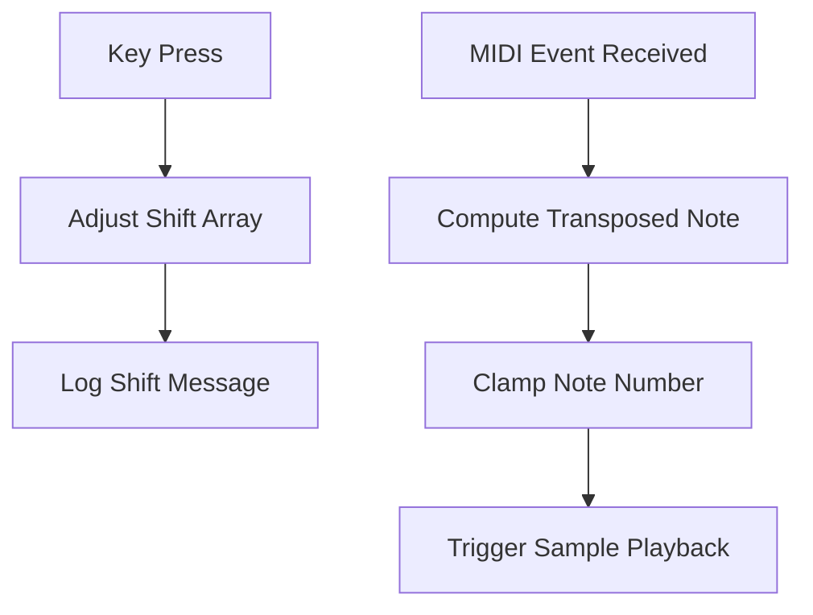

# Working with Sampler Modules and Samples – Octave Shifting of Modules

This section explains how to transpose incoming MIDI notes by octaves per sampler module. Each module maintains its own **octave shift** setting in the `global_numberofoctavetoshift` array. You can adjust shifts for all modules or only the currently selected module at runtime. All transpositions are logged in the GUI for easy tracking.

## Octave Shift Data Structure

The application uses a global array to store octave shifts:

- **Name**: `global_numberofoctavetoshift`
- **Size**: `SPITMIPS_MAXNUMBEROFSAMPLERMODULES`
- **Default**: All entries initialize to `0` (no shift) on startup or reset  .

Each element represents the number of octaves to shift (positive for up, negative for down). Shifts are clamped within **–11…+11** to prevent out-of-range MIDI notes.

## Selecting the Active Sampler Module

Before adjusting a single module’s shift, you must select it:

- **Left Mouse Click**: Increment `global_samplermodulesindex_selected`.
- **Right Mouse Click**: Decrement the index (wraps around).
- The selection index cycles through `[0 … global_numberofsamplermodules–1]`.

Selected module changes are printed via `StatusAddText`, e.g.:

```text
global_samplermodulesindex_selected is 2
```

## Keyboard Shortcuts for Octave Shifting 🎹

Use these keys to adjust octave shifts at runtime. All messages appear in the status log.

| Key(s) | Scope | Behavior |
| --- | --- | --- |
| Page Up (VK_PRIOR) | All modules | Increment each `global_numberofoctavetoshift[i]` |
| Page Down (VK_NEXT) | All modules | Decrement each `global_numberofoctavetoshift[i]` |
| Q or ↑ Arrow | Selected module | Increment shift for `global_samplermodulesindex_selected` |
| Z or ↓ Arrow | Selected module | Decrement shift for `global_samplermodulesindex_selected` |
| R | All modules | Reset all shifts to `0` |


### Key Handling Code Snippet

```cpp
// Reset all modules
case 0x52: // 'R'
    for (int i = 0; i < SPITMIPS_MAXNUMBEROFSAMPLERMODULES; i++) {
        global_numberofoctavetoshift[i] = 0;
        if (i < global_numberofsamplermodules) {
            swprintf(pWCHAR, L"reset to default, transposing %d octave all midi events mapping to sampler module %d\n",
                     global_numberofoctavetoshift[i], i);
            StatusAddText(pWCHAR);
        }
    }
    break;

// Increase all modules
case VK_PRIOR: // Page Up
    for (int i = 0; i < SPITMIPS_MAXNUMBEROFSAMPLERMODULES; i++) {
        global_numberofoctavetoshift[i]++;
        if (global_numberofoctavetoshift[i] > 11) global_numberofoctavetoshift[i] = 11;
        if (i < global_numberofsamplermodules) {
            swprintf(pWCHAR, L"transposing %d octave all midi events mapping to sampler module %d\n",
                     global_numberofoctavetoshift[i], i);
            StatusAddText(pWCHAR);
        }
    }
    break;

// Adjust selected module up
case 0x51: // 'Q'
case VK_UP:
    global_numberofoctavetoshift[global_samplermodulesindex_selected]++;
    if (global_numberofoctavetoshift[global_samplermodulesindex_selected] > 11)
        global_numberofoctavetoshift[global_samplermodulesindex_selected] = 11;
    swprintf(pWCHAR, L"transposing %d octave all midi events mapping to sampler module %d\n",
             global_numberofoctavetoshift[global_samplermodulesindex_selected],
             global_samplermodulesindex_selected);
    StatusAddText(pWCHAR);
    break;

// Adjust selected module down
case 0x5A: // 'Z'
case VK_DOWN:
    global_numberofoctavetoshift[global_samplermodulesindex_selected]--;
    if (global_numberofoctavetoshift[global_samplermodulesindex_selected] < -11)
        global_numberofoctavetoshift[global_samplermodulesindex_selected] = -11;
    swprintf(pWCHAR, L"transposing %d octave all midi events mapping to sampler module %d\n",
             global_numberofoctavetoshift[global_samplermodulesindex_selected],
             global_samplermodulesindex_selected);
    StatusAddText(pWCHAR);
    break;
```

## Runtime MIDI Note Transposition

When a MIDI note arrives, the system applies the module’s octave shift before playback:

1. **Receive MIDI message** in the input thread.
2. **Determine module index** (`chan`) based on `global_inputmidichannel` mapping.
3. **Compute transposed note number**:

```cpp
   int midinotenumber = data1; // 0–127
   midinotenumber += 12 * global_numberofoctavetoshift[chan];
   if (midinotenumber < 0 || midinotenumber > 127)
       midinotenumber = data1;
```

1. **Invoke polyphony engine**:

```cpp
   poly[chan].noteOn(chan, midinotenumber, data2);
```

1. **Clamp out-of-range** back to the original note to avoid invalid values.

## Logging and Tracking Transpositions

All adjustments and MIDI transpositions are echoed in the GUI’s status area via `StatusAddText`. Example log entries:

- 

**Reset**

`reset to default, transposing 0 octave all midi events mapping to sampler module 1`

- 

**Global Shift**

`transposing 2 octave all midi events mapping to sampler module 0`

- 

**Single Module Shift**

`transposing -1 octave all midi events mapping to sampler module 3`

These messages help you verify current shift settings during live performance.



*Diagram: Process flow from key press through to sample playback.*

---

By understanding and using these controls, you can dynamically transpose your sampler modules by octaves, enabling creative layering and performance flexibility on your Windows desktop system.