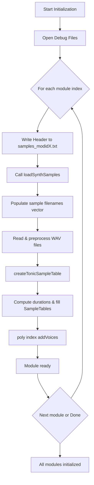

# Working with Sampler Modules and Samples

This section covers the **per-module initialization** routine that runs at application startup. It ensures each sampler module writes its own debug log, loads its WAV samples into Tonic data structures, computes per-note durations, and creates a polyphonic synth voice set for MIDI playback.

---

## Opening Per-Module Debug Files 📁

Each sampler module gets its own debug output file named `samples_modidX.txt`, where `X` is the module index. These files record all sample-loading diagnostics.

```cpp
for (int i = 0; i < SPITMIPS_MAXNUMBEROFSAMPLERMODULES; i++) {
  CHAR  pCharBuffer[256];
  sprintf(pCharBuffer, "_modid%d", i);
  string debugfilename = GetStringTimeStamp() + pCharBuffer + ".txt";
  if (i < global_numberofsamplermodules)
    pFILEarray[i] = fopen(debugfilename.c_str(), "w");
  else
    DeleteFileA(debugfilename.c_str());
}
```

- `**pFILEarray[i]**` points to `samples_modid{i}.txt`.
- Files are created only for active modules.

---

## Writing Module Header to Log 📝

Before loading samples, the app writes a standardized header block to each module’s log:

```cpp
if (pFILE2) {
  fprintf(pFILE2,
    "************************************************************\n"
    "module id %d on midi channel id %d\n"
    "loading samples in %s\n"
    "************************************************************\n",
    global_samplermodulesindex,
    global_samplermodulesindex,
    global_samplesfolders[global_samplermodulesindex].c_str()
  );
  fflush(pFILE2);
}
```

| Field | Description |
| --- | --- |
| **module id** | Sampler module index |
| **midi channel id** | Default MIDI channel (identical to module index) |
| **sample folder path** | Filesystem path of the WAV folder to load |


---

## Loading Synth Samples 🎛️

The core of per-module initialization is the call to `**loadSynthSamples**`, which:

1. **Enumerates WAV files** in the module’s folder (using a `DIR` shell command).
2. **Populates** `global_samplefilenames` vector with full paths.
3. **Allocates** `global_ppbuffer[module]` as an array of `SampleTable*` pointers.
4. **Reads** each `.wav` into a `WavSet`, normalizes to 44.1 kHz stereo.
5. **Extracts** MIDI note number from filename via `GetMidiNoteNumberFromString`.
6. **Calls** `createTonicSampleTable` to fill Tonic buffers and durations.

```cpp
// Per-module sample loading
loadSynthSamples(
  global_samplesfolders[global_samplermodulesindex],
  global_samplesfilter
);
```

- `**samplesfolder**`: Path to WAV folder
- `**samplesfilter**`: e.g., `"*.wav"`

---

## Initializing Tonic Sample Tables 🎚️

The helper `**createTonicSampleTable**` performs:

- Allocation of a `SampleTable` of size `(totalFrames × numChannels)`.
- Copying raw float PCM data into Tonic’s buffer.
- Storing note duration in seconds in `**global_sampleduration_s[module][note]**`.

```cpp
bool createTonicSampleTable(int moduleIndex, int midinote, WavSet* pWavSet) {
  global_sampleduration_s[moduleIndex][midinote] =
    pWavSet->totalFrames / float(pWavSet->SampleRate);
  global_ppbuffer[moduleIndex][midinote] =
    new SampleTable(pWavSet->totalFrames, pWavSet->numChannels);
  memcpy(
    global_ppbuffer[moduleIndex][midinote]->dataPointer(),
    pWavSet->pSamples,
    pWavSet->totalFrames * pWavSet->numChannels * sizeof(float)
  );
  return true;
}
```

- `**global_ppbuffer**`: 2D array `[module][note] → SampleTable*`
- `**global_sampleduration_s**`: 2D array of per-note durations (seconds)

---

## Creating Polyphonic Synth Voices 🎶

Once samples are loaded, each module initializes its Tonic polyphonic synth:

```cpp
poly[moduleIndex].addVoices(
  createSynthVoice,
  SPITMIPS_NUMBEROFVOICES
);
```

- `**poly**` is an array of `PolySynth` instances (one per module).
- `**addVoices**` calls the voice-factory `createSynthVoice` repeatedly to build `N` voices.
- Each voice wraps a `SuperBufferPlayer` bound to the module’s sample tables.

This enables **polyphony**: overlapping notes never steal each other until all voices are used.

---

## Per-Module Initialization Flow



---

**Key Data Structures**

| Name | Type | Purpose |
| --- | --- | --- |
| `global_samplesfolders` | `vector<string>` | Folders assigned to each module |
| `global_samplefilenames` | `vector<string>` per module | Full paths of WAV files |
| `global_ppbuffer[module][note]` | `SampleTable*` | Audio sample buffer for each MIDI note |
| `global_sampleduration_s[module][note]` | `float` | Duration in seconds for each sample |
| `poly[module]` | `PolySynth<Allocator>` | Polyphonic synth for each sampler module |


---

> **Note:** Proper error checking (e.g., missing files, unsupported sample rates) is performed inside `loadSynthSamples` and `createTonicSampleTable`, with warnings and errors logged in each module’s debug file.