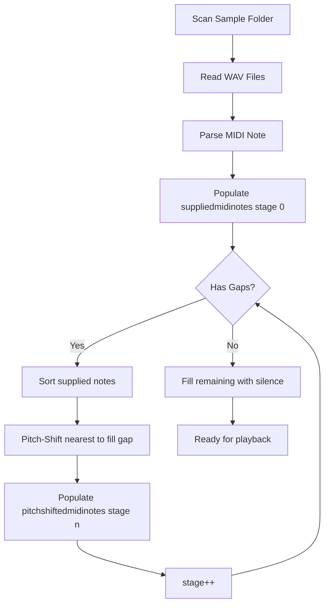

# Working with Sampler Modules and Samples – Sample Mapping and Classification

This section explains how the sampler instrument maps audio samples to MIDI notes and classifies them for playback. You will learn about the core data structures, how samples are loaded and gaps are filled via pitch‐shifting, and how classification files drive random or deterministic sample selection.

---

## Sample Mapping Data Structures 🗄️

The core arrays keep track of which samples correspond to each of the 128 MIDI notes for every sampler module and processing stage.

| **Name** | **Type** | **Dimensions** | **Purpose** |
| --- | --- | --- | --- |
| global_suppliedmidinotes | `vector<int>` | `[module][stage]` | MIDI notes for which real samples were supplied (stage 0) or inherited from prior stages |
| global_pitchshiftedmidinotes | `vector<int>` | `[module][stage]` | MIDI notes generated by pitch‐shifting nearest supplied samples to fill gaps (stage 1…MAXNUMSTAGE−1) |
| global_classifiedsamplefilenames | `vector<string>` | `[module][note]` | Lists of file paths loaded from classification text files, one per MIDI note |
| global_numberofmidinotes_silenced | `int` | `[module]` | Count of notes for which no sample or pitch‐shifted version was found, silenced by fallback to silence |
| global_ppbuffer | `SampleTable*` | `[module][note]` | Raw audio buffers for each MIDI note |
| global_sampleduration_s | `float` | `[module][note]` | Duration in seconds of each sample buffer |


These structures enable multi‐stage gap filling, classification‐based sample selection, and monitoring of silenced notes .

---

## Loading Samples and Mapping to MIDI Notes 🎵

When you point the app at a sample folder, it:

1. Executes a directory listing (`DIR … > spitmips_filenames.txt`).
2. Reads each `.wav` file path.
3. Parses the first three digits of the filename for the MIDI note number (0–127).
4. Loads the file into `global_ppbuffer[module][midinote]`.
5. Records the note in **stage 0** of `global_suppliedmidinotes[module][0]`.

```cpp
// Pseudocode for mapping filenames to MIDI notes
int midinote = GetMidiNoteNumberFromString(filename.c_str());
if (global_ppbuffer[mod][midinote] == NULL) {
  createTonicSampleTable(mod, midinote, &wavSet);
  global_suppliedmidinotes[mod][0].push_back(midinote);
}
```

This approach ensures every directly supplied sample is registered for later processing .

---

## Filling Gaps via Multi-Stage Pitch-Shifting 🔄

Not every MIDI note may have a supplied sample. To cover the full 0–127 range, the app iteratively pitch-shifts the nearest available samples up to `SPITMIPS_MAXNUMSTAGE` stages.



At each stage:

- Sort the list of supplied notes.
- For each gap, pick the nearest neighbor (up or down) whose semitone distance ≤12.
- Apply `smbPitchShift_threadsafe` to generate a new sample buffer.
- Record the new note in `global_pitchshiftedmidinotes[module][stage]`.
- Merge pitch‐shifted notes into the next stage’s supplied list.

```cpp
// Example of gap filling logic
for (int midinote = lower; midinote <= upper; midinote++) {
  int sem = midinote - supplied[i];
  if (abs(sem) < 13) {
    global_pitchshiftedmidinotes[mod][stage].push_back(midinote);
    pitchshift(mod, midinote, supplied[i]);
  }
}
```

This loop repeats until all notes are covered or `MAXNUMSTAGE` is reached .

---

## Classification-Based Sample Selection 📂

Instead of loading raw `.wav` files, you can supply classification text files listing multiple sample paths per MIDI note. The loader:

1. Lists all classification files (`spitmips_filenames_modidX.txt`).
2. For each classification file:
3. Reads lines of WAV file paths.
4. Parses the MIDI note index from the filename.
5. Populates `global_classifiedsamplefilenames[module][midinote]`.

```cpp
// Load classification entries
while (getline(ifs, classListFile)) {
  int midinote = atoi(classListFile.substr(dirEnd+1,3).c_str());
  global_classifiedsamplefilenames[mod][midinote].push_back(classListFile);
}
```

During playback, if `global_classifiedsamplefilenames[mod][note]` is non-empty, the engine randomly picks one:

```cpp
int count = global_classifiedsamplefilenames[mod][note].size();
int idx   = (count > 1) ? RandomInt(0, count - 1) : 0;
string sel = global_classifiedsamplefilenames[mod][note][idx];
loadAndBuffer(sel);
```

This delivers varied timbral results based on your classification lists .

---

## Configuration Flags and Silenced Notes ⚙️

Several global flags customize mapping behavior and report on silenced notes:

- **global_loopsamples_tominimum_s** (`float`)

Minimum loop duration; short samples will loop to avoid glitches.

- **global_reverseeveryothersample** (`bool`)

Reverse playback of alternating samples to reduce artifacts.

- **global_numberofmidinotes_silenced** (`int[module]`)

Incremented when no sample (direct or pitch-shifted) is available, replaced by silence .

Adjust these in your configuration file or command-line options to fine-tune playback.

---

## Practical Tips and Best Practices 📝

- **Organize Folders**: Name WAV files with three-digit MIDI note prefixes (`060_piano_C.wav`).
- **Use Classification**: Provide text files (`class_###.txt`) when you have multiple samples per note.
- **Monitor Logs**: The app writes `samples_modidX.txt` showing supplied and pitch-shifted notes and silenced counts.
- **Balance Stage Depth**: Increasing `SPITMIPS_MAXNUMSTAGE` improves coverage but costs load time.

```bash
# Example classification file: class_060.txt
060_piano_legato_001.wav
060_piano_legato_002.wav
060_piano_staccato_003.wav
```

> **Card Tip** {"title":"Naming Convention","content":"Prefix sample files with zero-padded MIDI note numbers (000–127)."}